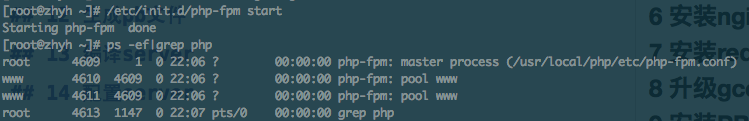

# Linux 安装 php

本次安装的PHP是php 5.3.28，选择从搜狐源下载。

## 1 下载PHP

```shell
wget http://mirrors.sohu.com/php/php-5.3.28.tar.gz
```

## 2 安装依赖

安装依赖的库，我选择从chinaunix.net下载的，速度也还可以。

### 2.1 libiconv

```shell
wget http://down1.chinaunix.net/distfiles/libiconv-1.14.tar.gz
tar -zxvf libiconv-1.14.tar.gz
cd libiconv-1.14
./configure
make -j 2&& make install
cd ..
```

### 2.2 libmcrypt

```shell
wget http://down1.chinaunix.net/distfiles/libmcrypt-2.5.7.tar.gz
tar -zxvf libmcrypt-2.5.7.tar.gz
cd libmcrypt-2.5.7
./configure
make -j 2&& make install
ldconfig
cd libltdl/
./configure --enable-ltdl-install
make && make install
cd ../../
```

### 2.3 mhash

```shell
wget http://down1.chinaunix.net/distfiles/mhash-0.9.3.tar.gz
tar -zxvf mhash-0.9.3.tar.gz
cd mhash-0.9.3
./configure
make -j 2 && make install
cd ../
```

### 2.4 其他

## 3 解压编译

```shell
tar -zxvf php-5.3.28.tar.gz
cd php-5.3.28
./configure --prefix=/usr/local/php --with-config-file-path=/usr/local/php/etc --enable-fpm --with-fpm-user=www --with-fpm-group=www --with-mysql=mysqlnd --with-mysqli=mysqlnd --with-pdo-mysql=mysqlnd --with-iconv-dir --with-freetype-dir --with-jpeg-dir --with-png-dir --with-zlib --with-libxml-dir=/usr --enable-xml --disable-rpath --enable-magic-quotes --enable-safe-mode --enable-bcmath --enable-shmop --enable-sysvsem --enable-inline-optimization --with-curl --enable-mbregex --enable-mbstring --with-mcrypt --enable-ftp --with-gd --enable-gd-native-ttf --with-openssl --with-mhash --enable-pcntl --enable-sockets --with-xmlrpc --enable-zip --enable-soap --without-pear --with-gettext --disable-fileinfo

make -j 2 ZEND_EXTRA_LIBS='-liconv' && make install
```

## 4 配置php

```shell
cp php.ini-production /usr/local/php/etc/php.ini
sed -i 's/post_max_size = 8M/post_max_size = 50M/g' /usr/local/php/etc/php.ini
sed -i 's/upload_max_filesize = 2M/upload_max_filesize = 50M/g' /usr/local/php/etc/php.ini
sed -i 's/;date.timezone =/date.timezone = PRC/g' /usr/local/php/etc/php.ini
sed -i 's/short_open_tag = Off/short_open_tag = On/g' /usr/local/php/etc/php.ini
sed -i 's/; cgi.fix_pathinfo=1/cgi.fix_pathinfo=0/g' /usr/local/php/etc/php.ini
sed -i 's/; cgi.fix_pathinfo=0/cgi.fix_pathinfo=0/g' /usr/local/php/etc/php.ini
sed -i 's/;cgi.fix_pathinfo=1/cgi.fix_pathinfo=0/g' /usr/local/php/etc/php.ini
sed -i 's/max_execution_time = 30/max_execution_time = 300/g' /usr/local/php/etc/php.ini
sed -i 's/register_long_arrays = On/;register_long_arrays = On/g' /usr/local/php/etc/php.ini
sed -i 's/magic_quotes_gpc = On/;magic_quotes_gpc = On/g' /usr/local/php/etc/php.ini
sed -i 's/disable_functions =.*/disable_functions = passthru,exec,system,chroot,scandir,chgrp,chown,shell_exec,proc_open,proc_get_status,ini_alter,ini_restore,dl,openlog,syslog,readlink,symlink,popepassthru,stream_socket_server/g' /usr/local/php/etc/php.ini
```

## 5 后期配置

```shell
ln -s /usr/local/php/bin/php /usr/bin/php
ln -s /usr/local/php/bin/phpize /usr/bin/phpize
ln -s /usr/local/php/sbin/php-fpm /usr/bin/php-fpm

cd ..
```

## 6 安装ZendGuardLoader

```shell
mkdir -p /usr/local/zend/
wget http://downloads.zend.com/guard/5.5.0/ZendGuardLoader-php-5.3-linux-glibc23-x86_64.tar.gz
tar -zxvf ZendGuardLoader-php-5.3-linux-glibc23-x86_64.tar.gz
cp ZendGuardLoader-php-5.3-linux-glibc23-x86_64/php-5.3.x/ZendGuardLoader.so /usr/local/zend/
cat >>/usr/local/php/etc/php.ini<<EOF
;eaccelerator

;ionCube

[Zend Optimizer] 
zend_extension=/usr/local/zend/ZendGuardLoader.so
zend_loader.enable=1
zend_loader.disable_licensing=0
zend_loader.obfuscation_level_support=3
zend_loader.license_path=
EOF

cd ..
```

## 7 修改php-fpm配置文件

```shell
cat >/usr/local/php/etc/php-fpm.conf<<EOF
[global]
pid = /usr/local/php/var/run/php-fpm.pid
error_log = /usr/local/php/var/log/php-fpm.log
log_level = notice

[www]
listen = /tmp/php-cgi.sock
listen.backlog = -1
listen.allowed_clients = 127.0.0.1
listen.owner = www
listen.group = www
listen.mode = 0666
user = www
group = www
pm = dynamic
pm.max_children = 10
pm.start_servers = 2
pm.min_spare_servers = 1
pm.max_spare_servers = 6
request_terminate_timeout = 100
request_slowlog_timeout = 0
slowlog = var/log/slow.log
EOF
```

## 8 创建php-fpm启动脚本

```shell
vim /etc/init.d/php-fpm
chmod +x /etc/init.d/php-fpm
```

以下是一份参考:

```
#! /bin/sh

### BEGIN INIT INFO
# Provides:          php-fpm
# Required-Start:    $remote_fs $network
# Required-Stop:     $remote_fs $network
# Default-Start:     2 3 4 5
# Default-Stop:      0 1 6
# Short-Description: starts php-fpm
# Description:       starts the PHP FastCGI Process Manager daemon
### END INIT INFO

prefix=/usr/local/php
exec_prefix=${prefix}

php_fpm_BIN=${exec_prefix}/sbin/php-fpm
php_fpm_CONF=${prefix}/etc/php-fpm.conf
php_fpm_PID=${prefix}/var/run/php-fpm.pid


php_opts="--fpm-config $php_fpm_CONF --pid $php_fpm_PID"


wait_for_pid () {
    try=0

    while test $try -lt 35 ; do

        case "$1" in
            'created')
            if [ -f "$2" ] ; then
                try=''
                break
            fi
            ;;

            'removed')
            if [ ! -f "$2" ] ; then
                try=''
                break
            fi
            ;;
        esac

        echo -n .
        try=`expr $try + 1`
        sleep 1

    done

}

case "$1" in
    start)
        echo -n "Starting php-fpm "

        $php_fpm_BIN --daemonize $php_opts

        if [ "$?" != 0 ] ; then
            echo " failed"
            exit 1
        fi

        wait_for_pid created $php_fpm_PID

        if [ -n "$try" ] ; then
            echo " failed"
            exit 1
        else
            echo " done"
        fi
    ;;

    stop)
        echo -n "Gracefully shutting down php-fpm "

        if [ ! -r $php_fpm_PID ] ; then
            echo "warning, no pid file found - php-fpm is not running ?"
            exit 1
        fi

        kill -QUIT `cat $php_fpm_PID`

        wait_for_pid removed $php_fpm_PID

        if [ -n "$try" ] ; then
            echo " failed. Use force-quit"
            exit 1
        else
            echo " done"
        fi
    ;;

    force-quit)
        echo -n "Terminating php-fpm "

        if [ ! -r $php_fpm_PID ] ; then
            echo "warning, no pid file found - php-fpm is not running ?"
            exit 1
        fi

        kill -TERM `cat $php_fpm_PID`

        wait_for_pid removed $php_fpm_PID

        if [ -n "$try" ] ; then
            echo " failed"
            exit 1
        else
            echo " done"
        fi
    ;;

    restart)
        $0 stop
        $0 start
    ;;

    reload)

        echo -n "Reload service php-fpm "

        if [ ! -r $php_fpm_PID ] ; then
            echo "warning, no pid file found - php-fpm is not running ?"
            exit 1
        fi

        kill -USR2 `cat $php_fpm_PID`

        echo " done"
    ;;

    *)
        echo "Usage: $0 {start|stop|force-quit|restart|reload}"
        exit 1
    ;;

esac
```

## 9 启动php-fpm

```shell
groupadd www
useradd -s /sbin/nologin -g www www

/etc/init.d/php-fpm start
```

见到如下图代表启动成功:



## 10 开机启动

```shell
chkconfig --level 345 php-fpm on
```

