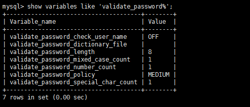
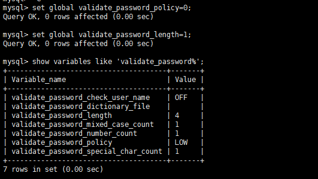
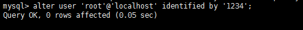

## 1、查看当前的密码策略

```sql
show variables like 'validate_password%';
```



## 2、各项值说明

validate_password_policy：密码安全策略，默认MEDIUM策略

策略 | 检查规则
---- | ----
0 or LOW | Length
1 or MEDIUM | Length; numeric, lowercase/uppercase, and special characters
2 or STRONG | Length; numeric, lowercase/uppercase, and special characters; dictionary file

* validate_password_dictionary_file：密码策略文件，策略为STRONG才需要

* validate_password_length：密码最少长度

* validate_password_mixed_case_count：大小写字符长度，至少1个

* validate_password_number_count ：数字至少1个

* validate_password_special_char_count：特殊字符至少1个

## 3、修改策略（将策略要求置为LOW，长度要求置为4）

```sql
set global validate_password_policy=0;
set global validate_password_length=1;
```



** 经测试，最小长度为4，设置为1无效 **

## 4、重置密码

```sql
alter user 'root'@'localhost' identified by 'root';
```



密码重置成功，可重新登录。
